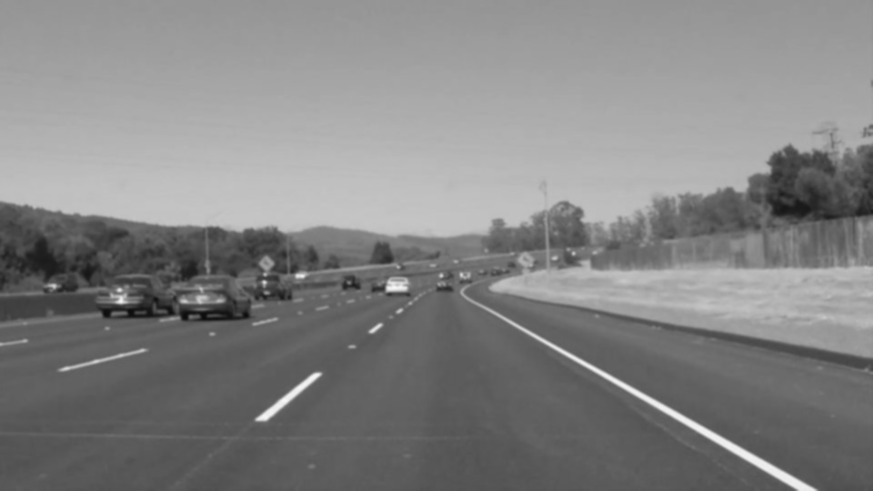

# **Finding Lane Lines on the Road** 
[](http://www.udacity.com/drive)


# Installation
To create an environment for this project using Conda use the following command:

```
conda env create -f environment.yml
```

After the environment is created, it needs to be activated with the command:

```
source activate carnd
```
and open the project's notebook [P1.ipynb](P1.ipynb) inside jupyter notebook:

```
jupyter notebook P1.ipynb
```

For Running it on the terminal with pip installation.

```
pip install -r requirements.txt
```

Then run the python file
```
python P1.py
```

Overview
---

* When we drive, we use our eyes to decide where to go.  The lines on the road that show us where the lanes are act as our constant reference for where to steer the vehicle.  Naturally, one of the first things we would like to do in developing a self-driving car is to automatically detect lane lines using an algorithm.

* In this project you will detect lane lines in images using Python and OpenCV.  OpenCV means "Open-Source Computer Vision", which is a package that has many useful tools for analyzing images.  

* Main Goal of this project is to create a pipeline to detect lanelines automatically and annotated them with a solid red line.

[project rubric](https://review.udacity.com/#!/rubrics/322/view)


### Main functions of the pipeline :

--- 
* Convert Color image to grayscale for easier manipulation.


* Applying Gaussian blur to smooth the edged on the image.


* Applying Canny edge detection with appropiate parameters to detect edge.


* Considering Edges in a Region Of Interest(ROI) and discard all other edges.


* Applying Hough transform to find all the lines.

* Average all left and right lane line to create a smooth line in each side and annotated them with red color.


* Adding the line with the original image.

---

First the Pipeline was tested on images contained in **test_images** folder
and store them in **test_images_output** folder.


Then the pipeline was applied on videos.


## Shortcomings :

* This pipeline doesn't work well in a road like sunshine or cross light as in grayscale image either it is all white or all black. So it didn't able to detect the Lane lines in those environments.

* Another shortcoming is the reflection of car glass on the images which sometimes create noises when detecting edges.

* If we take suddent turn on lanes , it will not be able to correctly identified.

## Future Improvements :

* To make it more robust Color space can be used to find white lines and the yellow lines simulteneously and more effectively.


